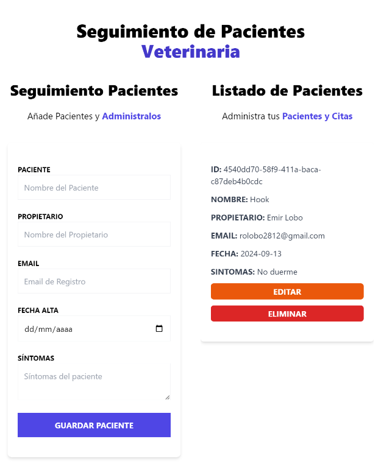

<!-- Banner -->


# 👋 ¡Hola, gracias por visitar mi Proyecto!

## 🚀 Proyecto: Administrador de Pacientes

Este es el frontend de **Administrador de Pacientes**, una aplicación web diseñada para gestionar pacientes de manera eficiente. Con esta aplicación, puedes visualizar, agregar, modificar y eliminar pacientes, asegurando un control detallado y organizado.

## 🛠️ Tecnologías Utilizadas

- **React**: Librería para construir interfaces de usuario.
- **React Hook Form**: Manejo de formularios de manera sencilla y eficiente con validaciones integradas.
- **Zustand**: Gestión del estado global de la aplicación de manera simple y escalable.
- **React Toastify**: Librería para notificaciones, brindando una mejor experiencia de usuario con alertas personalizadas.
- **Local Storage**: Almacenamiento de datos en el navegador para persistencia de la información.
- **Tailwind CSS**: Framework de CSS para estilizar la aplicación con facilidad y rapidez.
- **TypeScript**: Un superset de JavaScript que añade tipos estáticos, mejorando la calidad y mantenimiento del código.

## 🎥 Prueba la Aplicación

Puedes probar la aplicación en vivo visitando [este enlace en Netlify](https://tuenlace.netlify.app).


## 📝 Funcionalidades Principales

- **Visualización de Pacientes**: Los pacientes se muestran en una lista organizada, permitiendo un fácil acceso a sus datos.
- **Agregar y Modificar Pacientes**: Formularios intuitivos para añadir nuevos pacientes o actualizar la información existente.
- **Eliminar Pacientes**: Los pacientes pueden ser eliminados con confirmación para evitar errores accidentales.
- **Notificaciones en Tiempo Real**: Uso de React Toastify para brindar alertas sobre las acciones realizadas (añadir, modificar, eliminar).
- **Persistencia de Datos**: Los datos de los pacientes se almacenan en el Local Storage, asegurando que la información persista incluso al recargar la página.

## 📂 Estructura del Proyecto

```bash
src/
├── components/       # Componentes reutilizables como formularios y listas de pacientes
└── types/            # Types de los datos del paciente
```

## 🚀 Cómo Empezar
1. Clona el repositorio:

```bash
git clone https://github.com/RodrigoLoboDev/REST_API_FRONTEND-PRODUCTS
```
2. Instala las dependencias:

```bash
npm install
```

3. Inicia el servidor de desarrollo:

```bash
npm run dev
```

## 🤝 Contribuciones
Las contribuciones son bienvenidas. Si tienes ideas para mejorar el proyecto, no dudes en abrir un issue o hacer un pull request.

## 📧 Contacto
- Email: rolobo2812@gmail.com
- LinkedIn: [Jesús Luis Rodrigo Lobo](https://www.linkedin.com/in/jes%C3%BAs-luis-rodrigo-lobo-6594a81b4/)
- GitHub: [RodrigoLoboDev](https://github.com/RodrigoLoboDev)

#### ⭐️ Si te gusta lo que hago, no dudes en seguirme y contribuir a mis proyectos. ⭐️